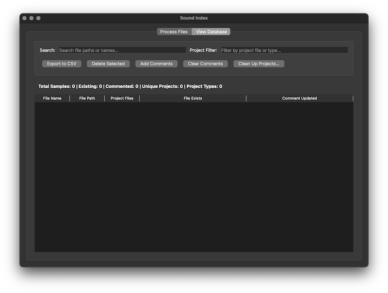

# Sound Index
A macOS desktop tool that scans DAW projects (Currently Ableton and Logic Pro), extracts sample references, and builds a searchable SQLite database with Finder comment tagging. The app doesn't touch or change the original files.

This grew out of my need to quickly understand my sample collection. I often used a sound in a project and later forgot about it. Having project usage info directly in Finder is practical. Currently supports both older and latest Ableton project file formats.

The code has been created with ChatGPT and Claude.

# Requirements
OS X  
Python 3.8+

**pip install PyQt5**  
Launch: **python soundindex.py**

Writes a single database file in the user's home folder.

## Getting Started

### Processing Projects
- **Drag & Drop**: Simply drag project files or folders onto the "Process Files" tab
- **Supported Formats**: `.als` (Ableton Live), `.logic` (Logic Pro 8/9), `.logicx` (Logic Pro 10/11)
  - NOTE: Sounds found from logicx bundle can sometimes be inside the bundle. Right click and Show Package Contents will reveal them.
- **Batch Processing**: The app automatically queues multiple files for processing

### Folder Scanning Options
- **Scan Folder**: Browse and process (re-scan) all projects in a selected folder
- **Full Re-scan**: Re-process all known projects in the database
- **Cancel**: Stop current processing at any time

## Filtering Options

### Folder Filtering
Enable filtering to exclude specific folders from processing:
- Check "Enable folder filtering"
- Enter comma-separated terms: `backup, freeze, packs, tmp, archive, old`
- The app will skip projects in folders and sample paths containing these terms

## Database Management

 

### Viewing Results
Switch to the "View Database" tab to:
- Browse all processed samples
- View file existence status and comment updates
- See project associations for each sample

### Search & Filter
- **Search**: Filter by file paths or names
- **Project Filter**: Filter by project file
- **Sort**: Click column headers to sort results

### Data Operations
- **Export**: Save database contents as CSV file
- **Delete**: Remove selected entries (select rows + Backspace key or button)
- **Selection**: Use CMD+A to select all currently listed entries

## Finder Comments (macOS Only)

### Adding Comments
- Select samples and click "Add Comments"
- Appends project type and count to Finder comments (e.g., "ALS: 3 projects")
- Only updates files that exist

### Clearing Comments
- Select samples and click "Clear Comments"
- Removes all project reference markers from Finder comments
- Preserves any other comment content

## Project Maintenance

### Clean Up Projects
Use "Clean Up Projects" to:
- Remove project references by folder patterns
- Handle old backup projects or temporary files
- Preview affected projects before removal

## Best Practices

1. **Regular Scans**: Periodically re-scan project folders to keep database current
2. **Use Filtering**: Exclude backup and temporary folders to avoid clutter
3. **Comment Management**: Use comment features to quickly identify sample usage in Finder

## Troubleshooting
- The app automatically skips unchanged projects during processing
- Missing files are shown in light red in the database view
- Processing can be cancelled at any time without losing previous work
